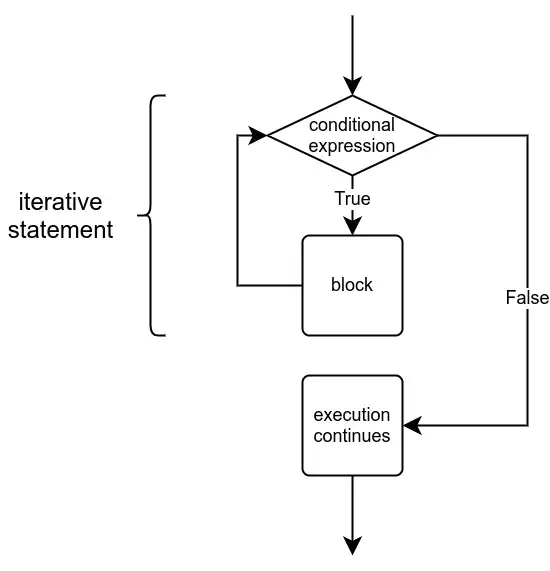
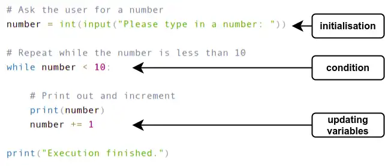

# Rapsberry Pi 
- Ran into some issues in terms of the kinds of display connectors I had access to for the Raspberry Pi 4, but I did successfully get the Raspberry Pi OS on a Raspberry Pi 3B from Canakit and was able to boot it, connect some peripherals (i.e. keyboard and mouse) and set up the basic OS settings
	
 
# MOOC coursework

## Helsinki Course: Introduction to Programming with Python
[Python Programming MOOC 2023](https://programming-23.mooc.fi/)

## Part Two
- [Part Two Lecture](https://youtu.be/xjBP3awP-I8)
- [Part Two Python Notes](/eng810/helsinki_mooc/py_notes/lecture_two.py)
- [Part Two Slides](/eng810/helsinki_mooc/written_notes/part_two.md)

### Topics Covered
- Programming terminology
	- Statement: A statement is a part of the program which executes something. It often, but not always, refers to a single command.
    - Block: A block is a group of consecutive statements that are at the same level in the structure of the program.
    - Expression: An expression is a bit of code that results in a determined data type. When the program is executed, the expression is evaluated so that it has a value that can then be used in the program.
    - Function: A function executes some functionality. Functions can also take one or more arguments, which are data that can be fed to and processed by the function. 
    - Type: Data type refers to the characteristics of any value present in the program.
    - Syntax (semantics): Similarly to natural languages, the syntax of a programming language determines how the code of a program should be written.
    - Debugging: If the syntax of the program is correct but the program still doesn't function as intended, there is a bug in the program.
- Using (len) to parse string for its length
- Floor functions in Python cause for floats to be rounded down to integers
- Python comparison operators can also be used on strings. String a is smaller than string b if it comes alphabetically before b.
	- Does require that the characters are all of the same case
- Logical operators (i.e. and / or)
- Conditionals and nested conditionals (including if, elif, & else)
- Simple loops
- Debugging print statements

## Part Three
- [Part Three Lecture](https://youtu.be/G0zdNWCm8h8)
- [Part Three Python Notes](/eng810/helsinki_mooc/py_notes/lecture_three.py)
- [Part Three Slides](/eng810/helsinki_mooc/written_notes/part_three.excalidraw)

### Topics Covered
- Functions and parameters
    - Functions are defined in this way:

    def function_name(parameter list):
        function code
- Loops with conditions

    

- Initialization refers to setting the initial value(s) of the variable(s) used within the condition of the loop; these are often called the iteration or iterator variables and they are performed before the loop is first entered
- The condition defines for how long the loop is set to be executed and is set out at the very beginning of the loop
- Updating variables means that within each repetition of the loop, the variables involved in the condition must be updated so that each iteration brings the loop one step closer to its conclusion
    
- Typical errors in constructing loops:
    - Forgetting to define how the variables will update to make progress toward the condition
- You can test looped code that would normally ask for input from a user by first "hard-coding" the input value and then using the input command later
- [Python Tutor](https://pythontutor.com/) site has a [code visualizer](https://pythontutor.com/visualize.html#mode=edit) that can be used to work through debugging issues with your code line by line
- String operations
    - Concatenation with the + operator
    - * operator can be used with a string when the other operand is an integer
    - len() returns number of characters in a string, which is always an integer value
    - As strings are essentially sequences of characters, any single character can also be retrieved -- the operator [] finds the character with the index specified within the brackets
    - You can also use negative indexing to access characters counting from the end of the string, with the last character in the string being indexed at -1

## Part Four
- [Part Four Lecture](https://youtu.be/U7MFzDabDqg)
- [Part Four Python Notes](/eng810/helsinki_mooc/py_notes/lecture_four.py)
- [Part Four Slides](/eng810/helsinki_mooc/written_notes/part_four.excalidraw)

### Topics Covered
