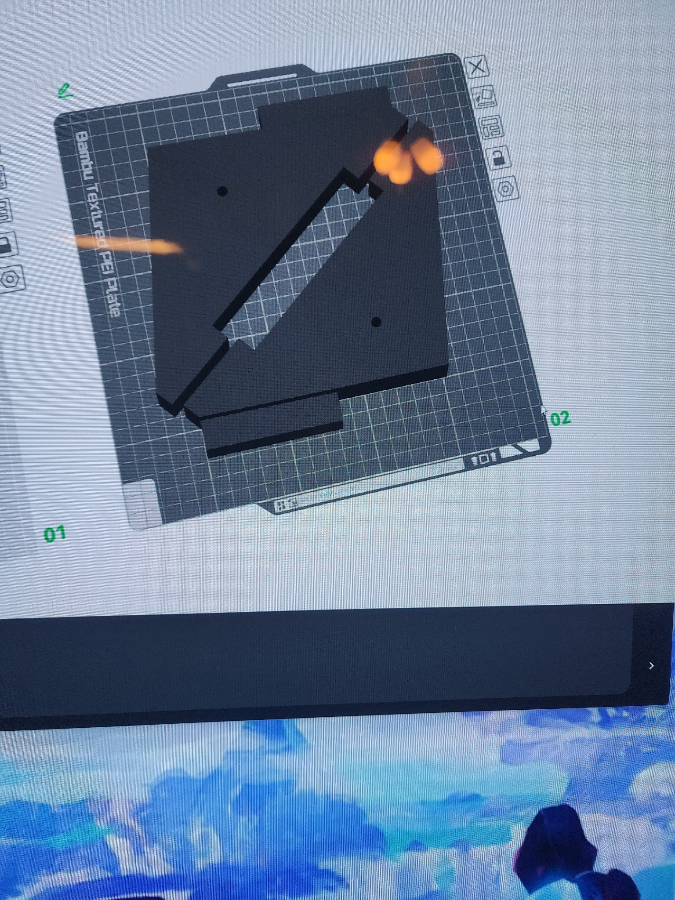

# Progress Update
- Gene visits Jon and I at our apartment to drop off the base handlebar, the 3D printed cradle lift stop, and the two cradle angles
- Gene had sent us a photo of him making adjustments to the cradle angle design files so that they could be successfully printed

# Images
