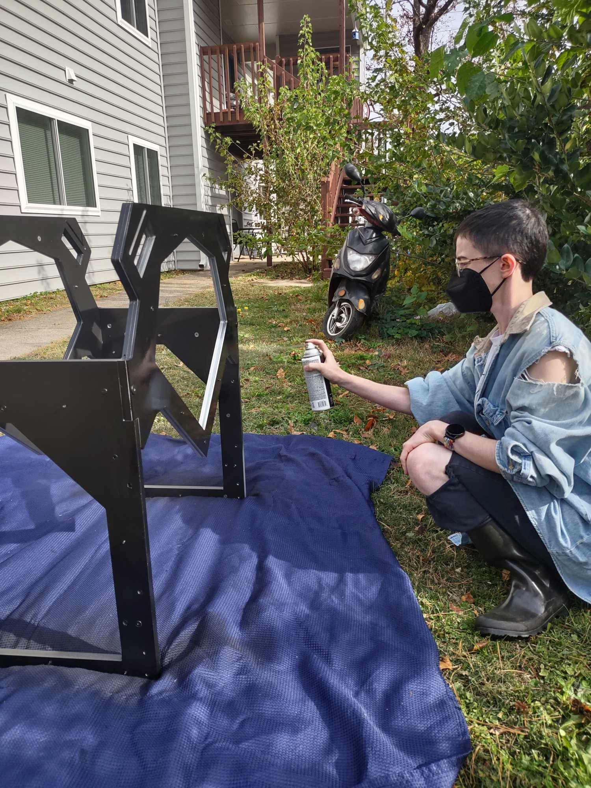

# Progress Update
- Day two of building
- Acquired more hardware for the project – I had made the mistake of trying to convert some of the bolts from metric to imperial due to a lack of stock at the stores we visited, as I had mistook the size tester that was available in-store as having accepted the threads for both kind of bolts, so we had to go to several different hardware stores because metric sizes were limited and difficult to find
- One of the major issues that has come up with the documentation on the DIYScanner page was a lack of information relating to the hardware types, possibilities for alternatives, etc., so I was also under the impression based on the notes that were available there that the scanner designer had accounted for people who live in areas where one kind of system is more frequent than the other, which led me to think he may have tried to use a size that was standard in both systems, which ended up not being the case
- Continued wood staining and sanding
- Spray painted base of cradle
- Finished assembling the scanner base and tested movement of the cradle lifters
- One of the [short arms](https://diybookscanner.org/archivist/indexc361.html?page_id=137) broke while building, which is going to need replaced

# Images

# Videos
<video controls src="images/ScannerDay2Progress.mp4" title="Title"></video>

<video controls src="images/ScannerDay2ProgressDemonstration.mp4" title="Title"></video>