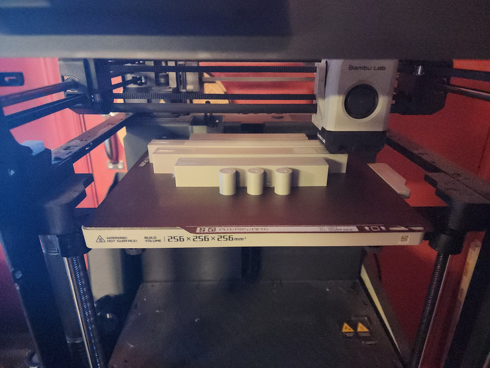
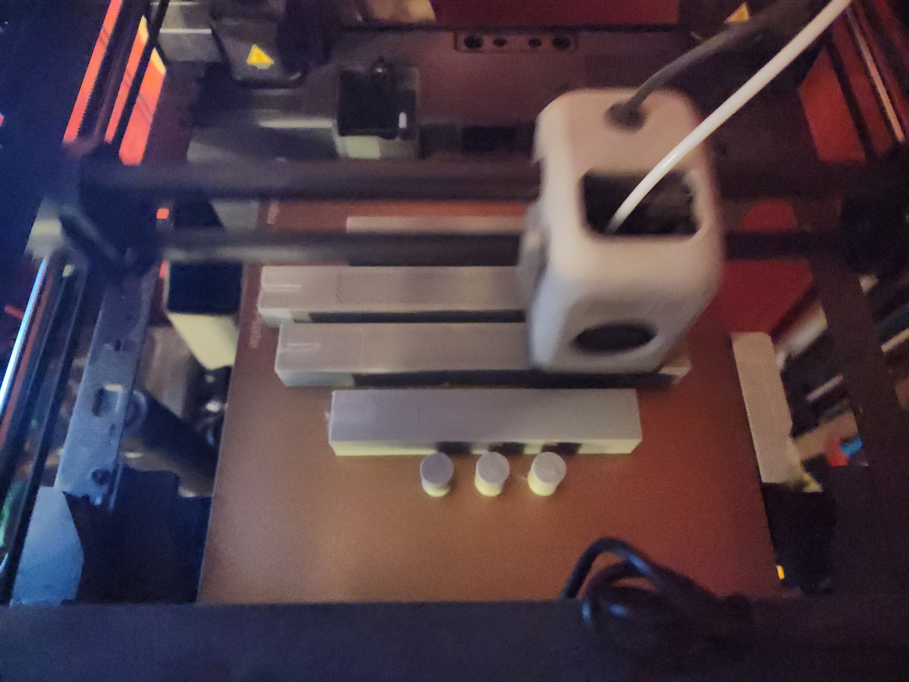
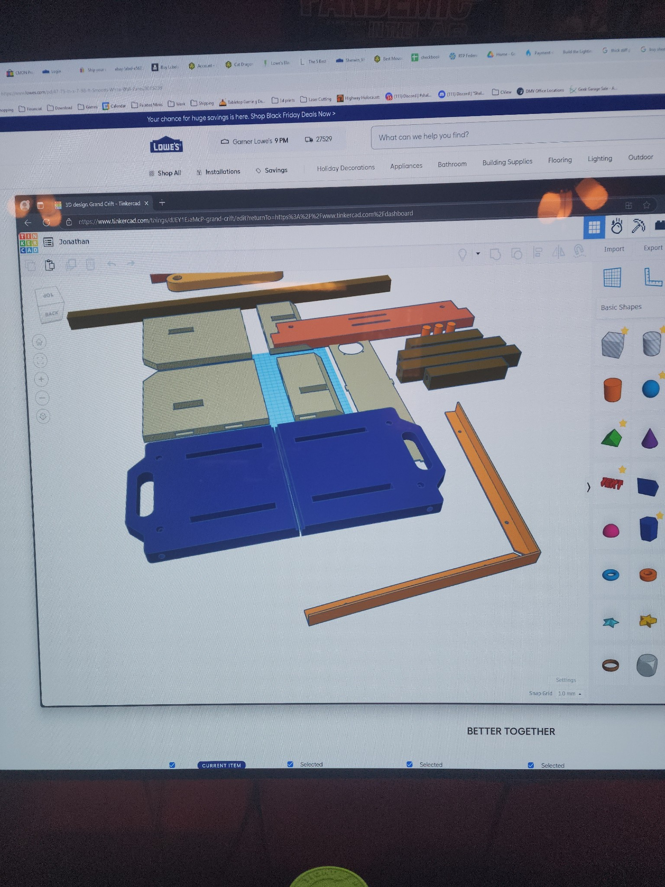
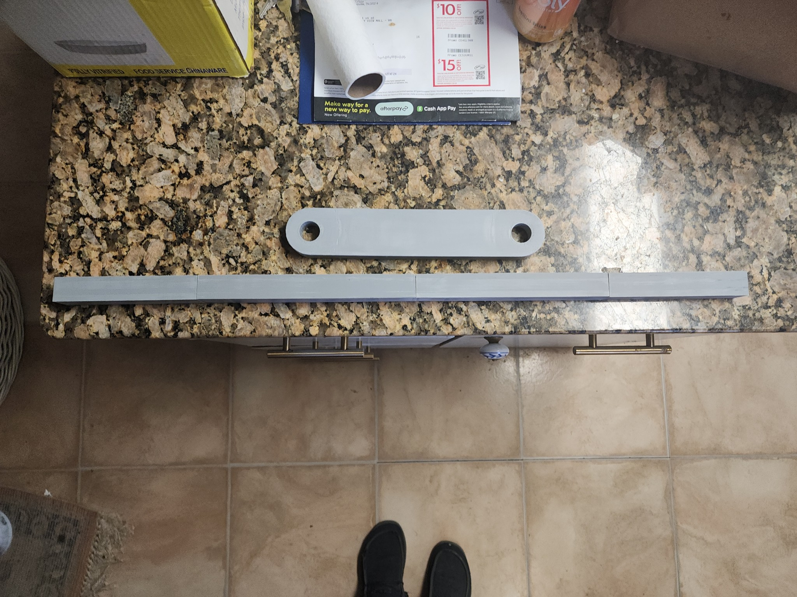

# Progress Updates
- Gene provides an update status for the two cradle runners printing, and we stopped by while we were already picking up more spray paint and hardware. 
- At that time, we were able to pick up the short arm replacement since the cradle runners were actively printing while we visited. One had already printed, and he showed us the other one that was in progress. 
- The cradle runners were printed in multiple pieces, due to the size limitations of his 3D printers, so he let us know that he would use epoxy to attach them. He also showed us the design files for the rest of the parts that would be printed.
- He also gave us an update on what was printed at the end of the day

# Images

