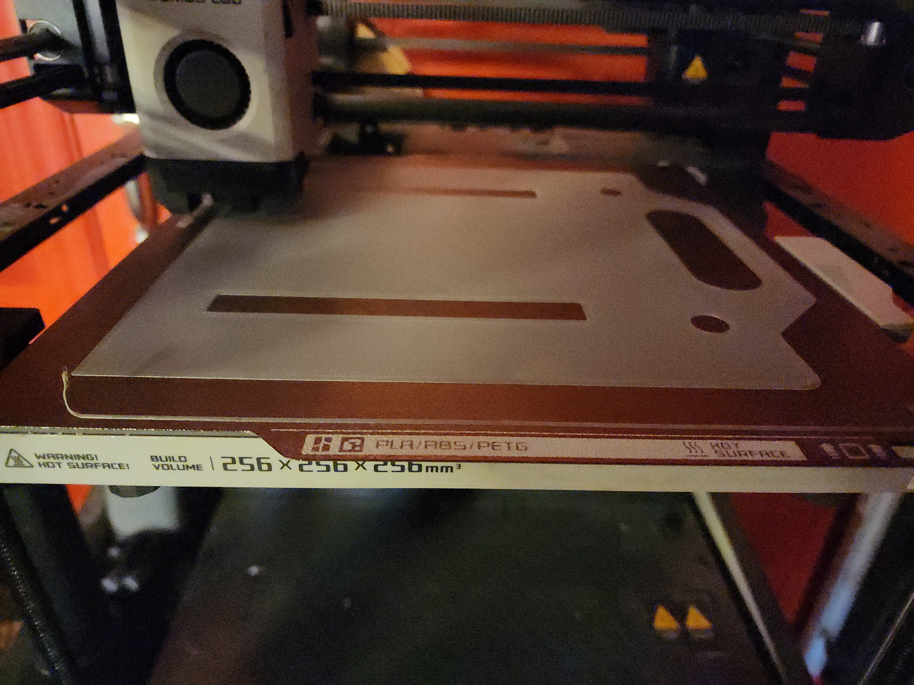

# Progress Update
- Day four of building
- Continued to try to troubleshoot issues with cradle runners and other 3D printed parts for the scanner base
- Several 3D printed pieces broke due to a lack of infill making them very weak and unable to withstand force of being bolted onto the base or carrying the weight of the cradle runners – this made the cradle runners and first iteration of 3D printed parts the most frustrating part of the scanner building process for me
- The cradle runners were found to be overall defective, requiring that we switch from them being 3D printed to instead wooden squares
- Tried to source ABS from local stores but found that this kind of plastic is largely unavailable, so we went to Lowes to try to find an alternative based on Gene’s recommendation and purchased a sheet of tempered artwood to potentially laser cut or trace and saw the ABS parts of the scanner ourselves
- We printed out PDFs of the ABS parts to size to see if we could trace the designs onto the artwood; this ended up taking several hours and was ultimately unsuccessful because there are very small cutouts that we would not be able to replicate precisely enough without a laser cutter
- Gene provides update on cradle base printing 

# Images

