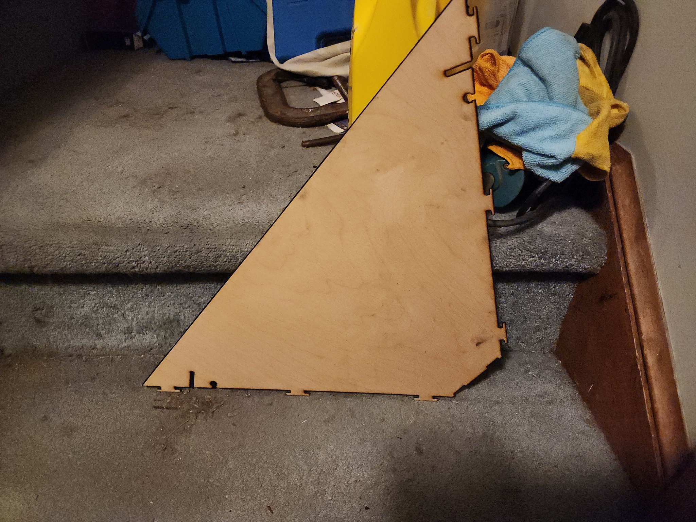

# Progress Updates
- Jon and I bring the artwood to Gene’s home to begin laser cutting the ABS parts (now referred to as lighting module parts). Gene and Jon made modifications to the parts’ DXF files for the [side plates of the lighting module](https://diybookscanner.org/archivist/indexfe70.html?page_id=253#:~:text=Large%20Front/Rear%20Plate%20of%20the%20Lighting%20Module.) using AutoCAD to prepare the files for laser cutting. Due to the complexity of the part shapes, Gene recommended that we try using some extra hardwood he had available for these parts, especially because there were concerns about what kinds of fumes other materials, including the artwood, might give off. We were able to successfully begin laser cutting the [first large side plate](https://diybookscanner.org/archivist/indexfe70.html?page_id=253#:~:text=Large%20Side%20Plate%20of%20the%20Lighting%20Module.) for the lighting module, but we found that it took a substantial amount of passes with the laser cutter in order to cut through the entire thickness of the plywood. We were present for about an hour while waiting for the piece to successfully cut, at which point we collectively agreed that Gene would work on running the laser cutter on more of the parts in the meantime and we would return to pick up the materials later. Gene also helped us cut two pieces of aluminum that we brought to create the scanner’s [two glass brackets](https://diybookscanner.org/archivist/indexd74f.html?page_id=196).

# Images

# Video
<video controls src="images/Lasercutting.mp4" title="Title"></video>