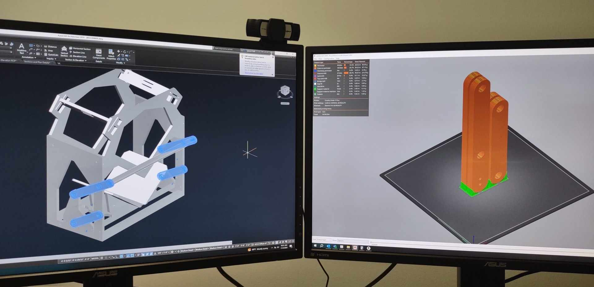
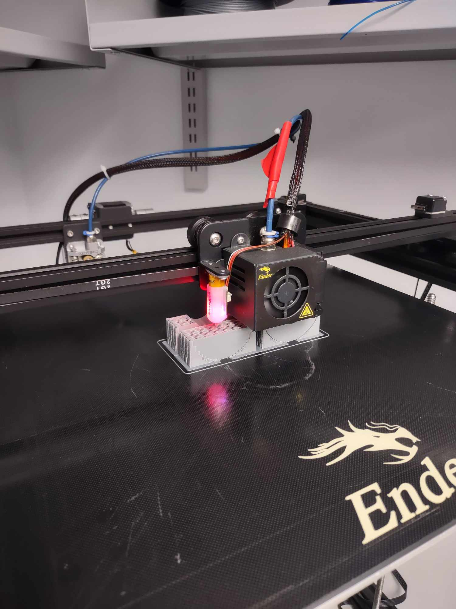
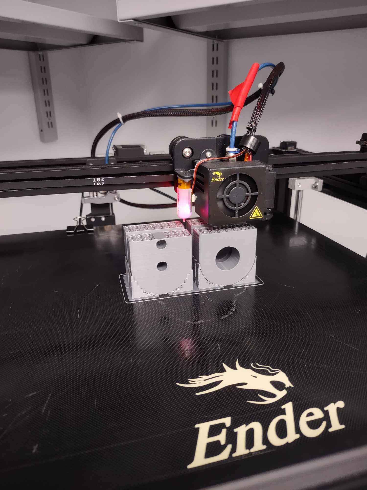
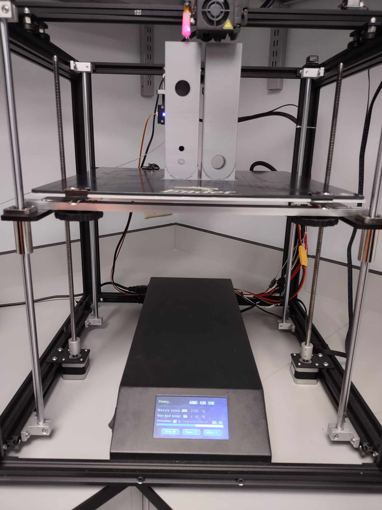

# Progress Update
- Files sent by Jonathan for production to CNC operator and design manager.

- Jon began 3D Printing of [short arms](https://diybookscanner.org/archivist/indexc361.html?page_id=137) and [long arms](https://diybookscanner.org/archivist/indexa7df.html?page_id=133) for scanner - projected to be complete by November 7th.

# Images

# Video Clips

<video controls src="images/ScannerArmPrintingClip.mp4" title="Title"></video>

