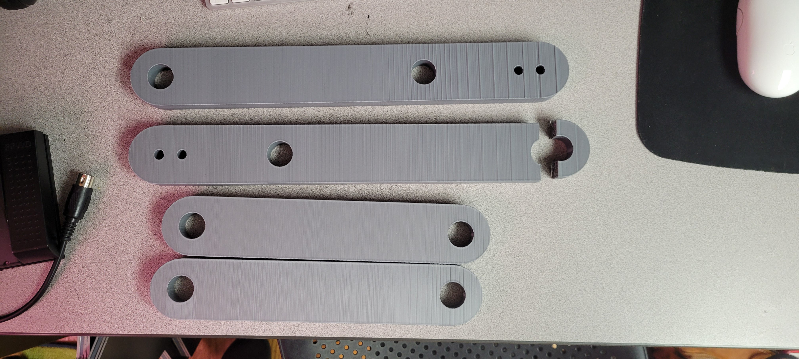

# Progress Update
Long and short arms have finished printing, these were printed by Jon. One of the short arms did not print successfully and will need to be reprinted, but the parts overall look like they are in good condition.

# Images
