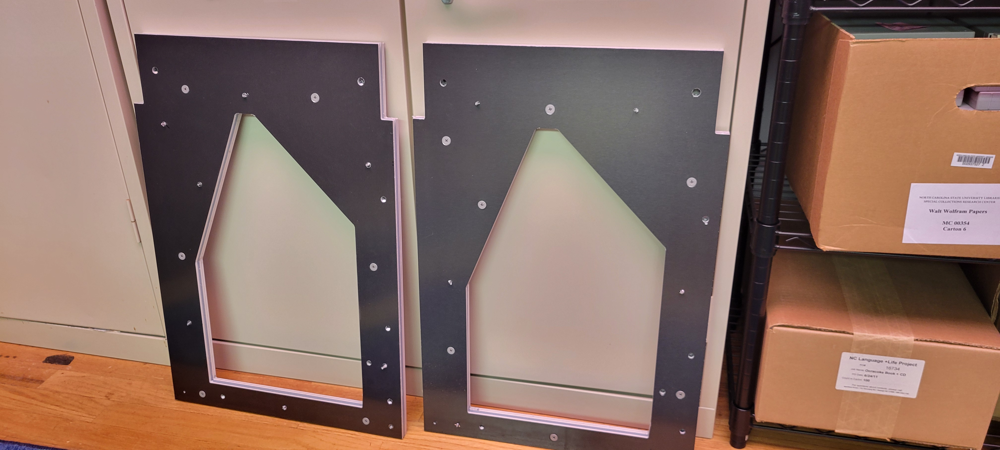
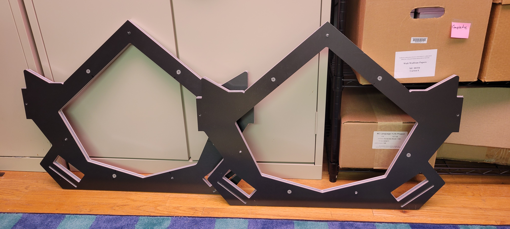
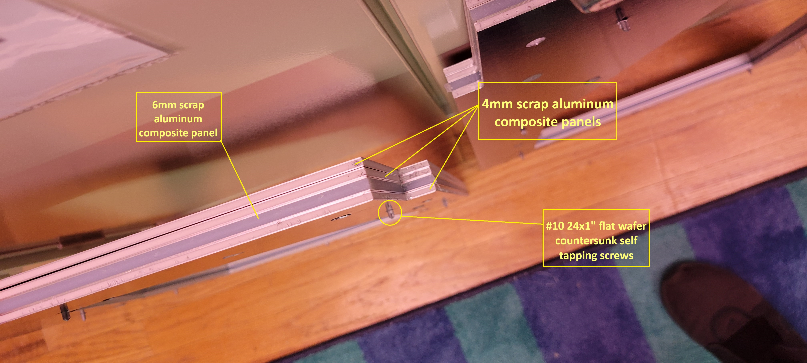

# Progress Update
- Aluminum composite panels for the front and back plate and the side plates have completed production. This involved riveting four different scrap panels together using countersunk screws, including three 4mm panels and a 6mm panel, to meet the 18mm thickness specifications. 

- We attempted to select the necessary hardware and fasteners for the project so that we could begin assembling the various components as they finish printing, but we found that the instructions are not always consistent or clear about the kinds of bolts needed. We went to a locally owned hardware store, and though they have a wide selection, we were frustrated to find that we did not know precisely what we were working for. Many of the [bolts in the tutorial](https://diybookscanner.org/archivist/indexf72e.html?page_id=512) are in metric units, and there are not always details about what kinds of threads are needed, so we decided to instead go back and review the design and essentially reverse engineer the bolts by checking the dimensions of the holes in the ACP to make sure we would use the right hardware. The lesson learned here was that we should have checked the hardware we were using for the entire design before sending any of the plates into production. 

- Jon began 3D printing the two cradle lifters

# Images

