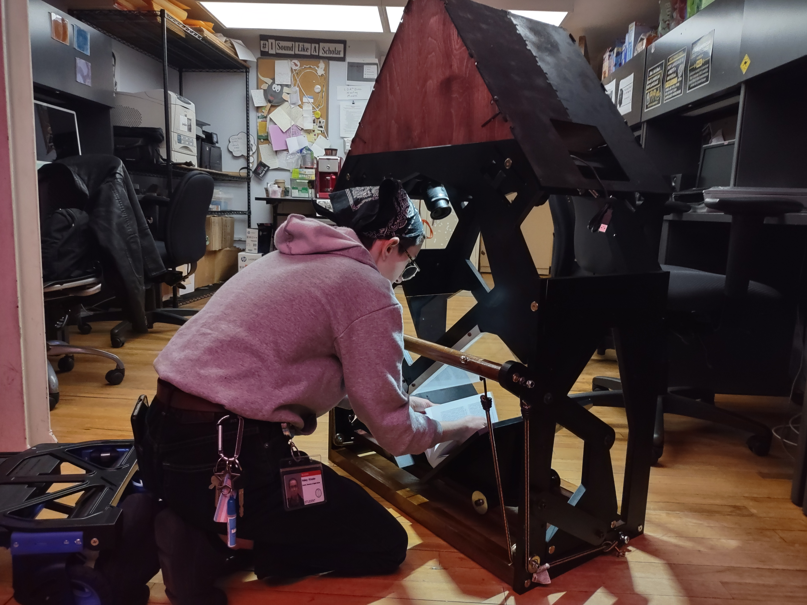
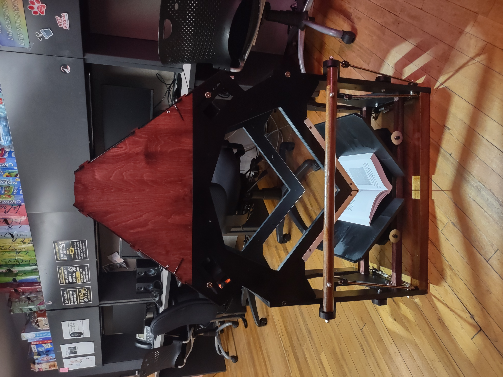

# Progress Updates
- Day eight of building
- Finished staining new cradle runners
- Brought the scanner to the linguistics lab to prepare it for class presentation

# Images

.jpg>)

# Videos
<video controls src="videos/VID_20241209_193814878.mp4" title="Title"></video>